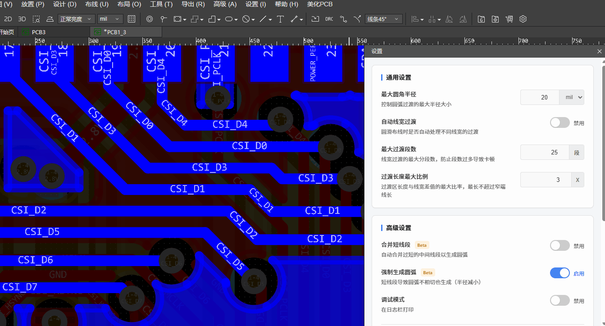
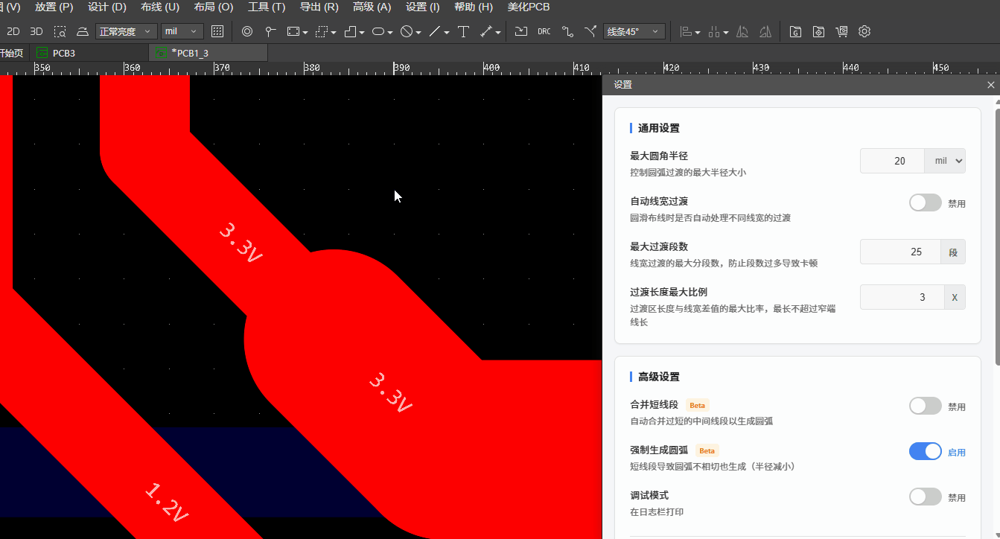
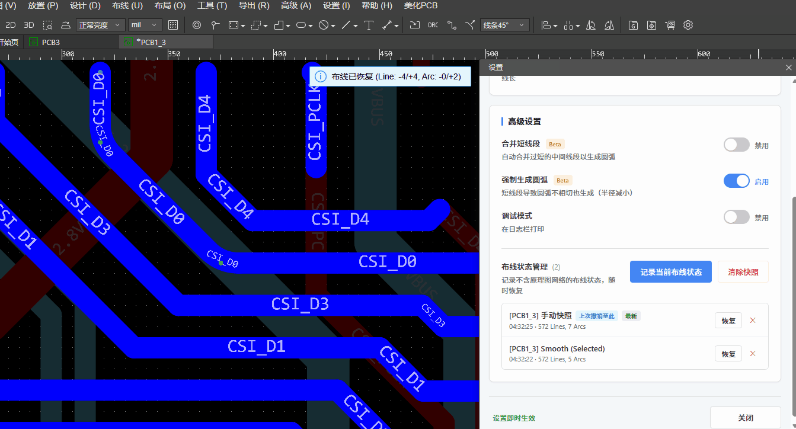
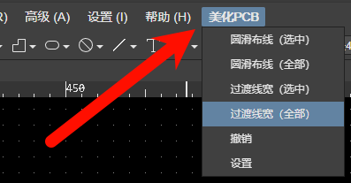
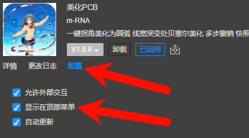

# 美化PCB

嘉立创EDA专业版扩展 —— **美化PCB**：一键将PCB拐角美化为圆弧，线宽突变处贝塞尔美化（更好的泪滴）支持多步撤销、快照管理、合并短线段，强制圆弧生成等高级美化功能

1、拐角美化为圆弧（可二次编辑半径）



2、突变线宽平滑美化（基于贝塞尔曲线）



3、快照管理 & 撤销支持



> ⚠️ 插件开发中，建议操作前备份工程，遇到问题欢迎反馈。

## ✨ 功能

| 功能 | 说明 |
| ------ | ------ |
| 圆滑布线 | 折线拐角 → 平滑圆弧，可调节最大半径 |
| 线宽过渡 | 不同线宽间平滑渐变（更好的泪滴），基于贝塞尔曲线算法 |
| 快照管理 | 自动/手动快照，随时一键恢复布线状态，防止误操作 |
| 高级控制 | 支持强制小半径圆弧生成、合并短线段等高级策略 (Beta) |

## 📖 使用

**菜单位置：** 高级 → 美化PCB

- **圆滑布线（选中/全部）** - 处理走线拐角(基于圆弧走线美化)
- **过渡线宽（选中/全部）** - 生成线宽渐变(基于贝塞尔曲线美化)
- **撤销** - 回退到上一步操作（支持多步撤销）
- **设置** - 配置半径、过渡参数、快照等选项




可通过 高级 → 扩展管理器 → 已安装扩展 → 美化PCB → 配置 勾选显示在顶部菜单，方便使用



## 🚀 参与贡献

欢迎Fork & PR！开发环境搭建如下：

### 克隆仓库

```bash
git clone --recursive https://github.com/m-RNA/Easy_EDA_PCB_Beautify.git
cd Easy_EDA_PCB_Beautify
```

### 已克隆？拉取子模块

```bash
git submodule update --init --recursive
```

> ⚠️ **注意：** 子模块已锁定到兼容的特定版本，请勿使用 `--remote` 参数更新，否则可能导致编译失败。

### 安装 & 构建

```bash
npm install
npm run build
```

构建产物：`build/dist/` 目录下的 `.eext` 扩展包

### 开发注意

劳请阅读此文件，不要踩坑： [DEVELOPER_NOTES.md](./DEVELOPER_NOTES.md)

## 📁 结构

```txt
src/
├── index.ts               # 入口 & 菜单注册
└── lib/
    ├── beautify.ts        # 拐角圆滑 (Beautify)
    ├── widthTransition.ts # 线宽过渡
    ├── snapshot.ts        # 快照管理
    ├── math.ts            # 数学工具
    ├── eda_utils.ts       # EDA 工具
    ├── logger.ts          # 日志打印
    └── settings.ts        # 设置读写
iframe/
└── settings.html          # 设置界面
pro-api-sdk/               # Git子模块 (嘉立创专业版扩展API SDK)
```

## 📜 License

这个项目采用 Apache-2.0 许可证，详情见 [【Apache-2.0 许可证】](https://www.apache.org/licenses/LICENSE-2.0.txt)
