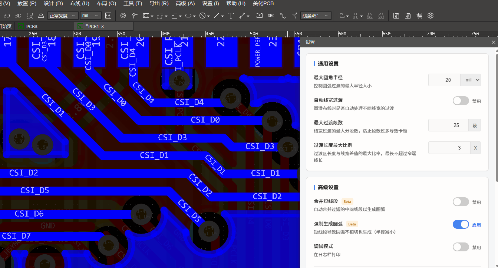
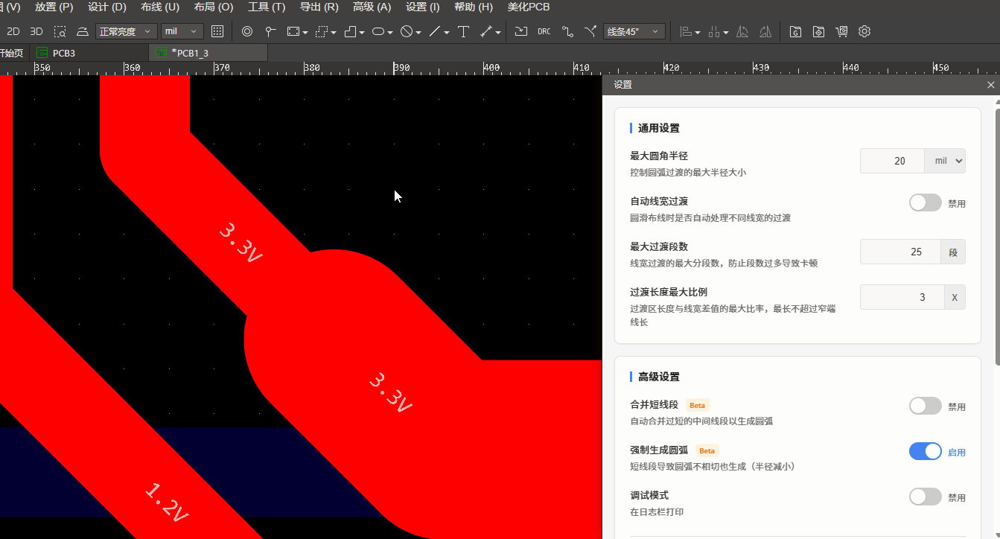
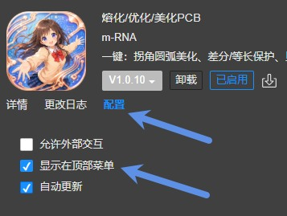
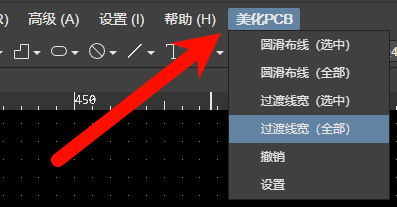
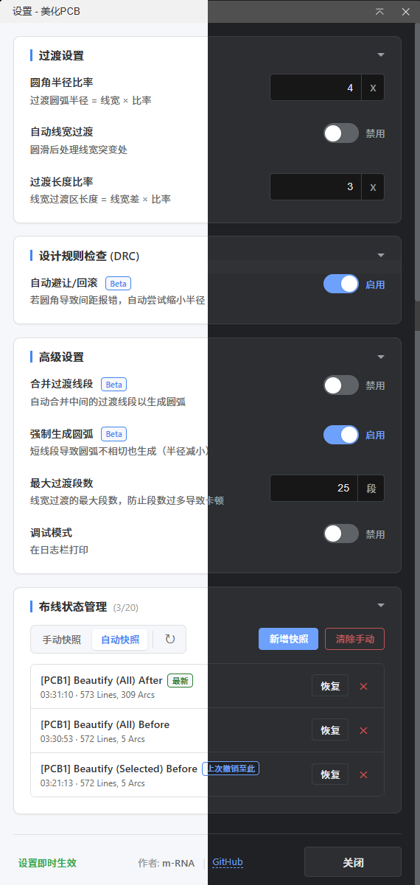

#  | 熔化/优化/美化PCB

[简体中文](./README.md) | [English](./README.en.md) | 当翻译有偏差时，请以中文版本为准

一键将 PCB 拐角优化为圆弧，改善几何连续性与布线观感，降低尖角带来的制造与应力风险；线宽突变处支持贝塞尔过渡（支持位置偏移调节）；支持差分/等长保护、DRC检查、覆铜自动重铺、多步撤销、快照管理、合并过渡线段、强制圆弧生成等高级优化功能

> 灵感：[【熔化你的电路板: PCB美学与圆滑布线设计】](https://www.bilibili.com/video/BV1Z2rWBYE6n)

1、拐角美化为圆弧（可二次编辑半径）



2、突变线宽平滑美化（基于贝塞尔曲线）



3、快照管理 & 撤销支持

4、DRC 规则检查


> 注意：插件开发中，建议操作前备份工程，遇到问题欢迎反馈。

## 使用

**菜单位置：** 高级 → 美化PCB

- **圆滑布线（选中/全部）** - 处理走线拐角(基于圆弧走线美化)
- **差分/等长保护** - 默认识别 DRC 中的差分对和等长网络组，匹配成功时使用同心圆弧，无法可靠匹配时保守保持直角
- **过渡线宽（选中/全部）** - 不同线宽间平滑渐变（基于贝塞尔曲线美化，支持位置偏移调节）
- **DRC 规则检查** - 先乐观布线，再规则检查，将不符合规则进行回退；支持忽略覆铜规则
- **覆铜自动重铺** - 执行全部操作后自动重铺所有覆铜区域（由于 API 性能限制，默认保护阈值为 5 个区域）
- **撤销 / 快照** - 基于**增量同步引擎**的多步撤销，仅更新变化图元，秒级恢复大型 PCB；支持手动/自动快照视图切换
- **高级设置** - 配置半径、过渡参数、管理快照、**自定义快捷键**、支持卡片排序与折叠，记忆个性化布局

## 适用场景与注意事项

- 圆滑布线更适合用于布线观感优化、柔性基板、高压、大电流、部分射频或对尖角敏感的场景。对普通低速板通常风险较低，但仍建议保留快照并检查 DRC。
- 高频数字、射频、阻抗控制网络不要无脑全局圆滑。外观看起来平滑不等于信号反射更低，关键网络应结合阻抗、线长和 SI 仿真评估；线宽过渡长度也应按实际频率与结构计算（例如 `Variational Theory of the Tapered Impedance Transformer` 中的 tapered impedance transformer 思路）。
- Pad 到导线的直连位置不一定适合自动平滑。某些高速设计中，局部挖空、阻抗补偿或保持原始连接方式可能更合适。
- 差分/等长保护默认开启。插件会优先对可可靠匹配的拐角使用同心圆弧；无法可靠匹配时会保守保持直角，避免为了圆滑而破坏长度关系。操作后仍建议用 EDA 的网络长度、等长规则和 DRC 再确认。
- 导出生产文件前请用 Gerber 预览或制造检查确认最终图形，尤其是强制圆弧、线宽过渡和复杂板边/覆铜附近的修改。

可通过 高级 → 扩展管理器 → 已安装扩展 → 美化PCB → 配置 勾选“显示在顶部菜单”，方便使用（右键菜单API暂未开放）







## 参与贡献

欢迎 Fork & Pr！开发环境搭建如下：

### 克隆仓库

```bash
git clone --recursive https://github.com/m-RNA/Easy_EDA_PCB_Beautify.git
cd Easy_EDA_PCB_Beautify
```

### 已克隆？拉取子模块

```bash
git submodule update --init --recursive
```

> 注意：子模块已锁定到兼容的特定版本，请勿使用 `--remote` 参数更新，否则可能导致编译失败。

### 安装 & 构建

```bash
npm install
npm run build
```

构建产物：`build/dist/` 目录下的 `.eext` 扩展包

### 开发注意

劳请阅读此文件，不要踩坑： [agents.md](./agents.md)

## 结构

```txt
src/
├── index.ts               # 入口 & 菜单注册
└── lib/
    ├── beautify.ts        # 拐角圆滑 (Beautify)
    ├── arcGeometry.ts     # 圆角与同心圆弧几何计算
    ├── widthTransition.ts # 线宽过渡
    ├── drc.ts             # DRC 检查与覆铜过滤
    ├── snapshot.ts        # 快照管理
    ├── shortcuts.ts       # 快捷键注册
    ├── math.ts            # 数学工具
    ├── eda_utils.ts       # EDA 工具 (覆铜重铺等)
    ├── logger.ts          # 日志打印
    └── settings.ts        # 设置读写
iframe/
└── settings.html          # 设置界面
pro-api-sdk/               # Git子模块 (嘉立创专业版扩展API SDK)
```

## License

这个项目采用 Apache-2.0 许可证，详情见 [【Apache-2.0 许可证】](https://www.apache.org/licenses/LICENSE-2.0.txt)
